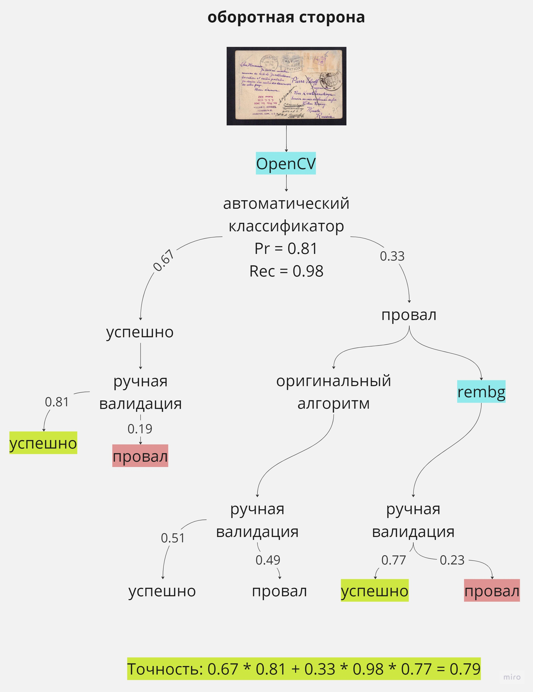

# Обрезка полей на сканах открыток

## Методы обрезки
1. Сканнер документов OpenCV
2. Библиотека rembg для удаления фона с фотографий
3. Оригинальный метод обрезки 

Примеры работы методов можно найти в `postcards_cropping_orig_method` (оригинальный метод) и `postcards_cropping_opencv_rembg` (библиотека rembg и сканнер документов на основе OpenCV).

`crop_orig_method.py`, `crop_rembg.py`, `crop_opencv.py` -- код из ноутбуков `postcards_cropping_orig_method`, `postcards_cropping_opencv_rembg` в виде скриптов для удобства использования

## Обобщенный алгоритм обрезки
1. Обрезать поля сканнером документов OpenCV
2. Автоматически определить, была ли обрезка успешной
3. Если обрезка была успешной, передать результат на ручную валидацию
4. Иначе:
* если это лицевая сторона открытки, применить оригинальный метод обрезки
* если это оборотная сторона открытки, применить библиотеку rembg
5. Передать результат обрезки в п. (4) на ручную валидацию

## Точность алгоритма
Ожидаемая точность обобщенного алгоритма составляет **0.82** в среднем (0.86 для лицевой стороны, 0.79 для оборотной).

Эти значения были получены на основании ручной валидации 1935 результатов обрезки. Подробный анализ можно найти в `cropping_post_validation`.

